# Functions - Hands-on Lab Script - part 1

Mark Harrison : 3 Dec 2017


- [Part 1 - Functions](functions-1.md)  ... this document
- [Part 2 - Functions with Visual Studio](functions-2.md)
- [Part 3 - Functions with CLI](functions-3.md)

## Overview

Functions is a serverless compute service that enables you to run code on-demand without having to explicitly provision or manage infrastructure. Use Azure Functions to run a script or piece of code in response to a variety of events.

## Create Function

Option 1

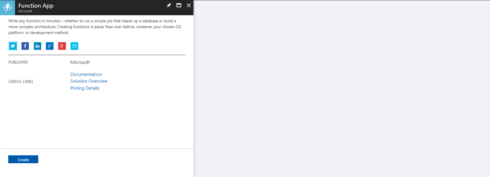

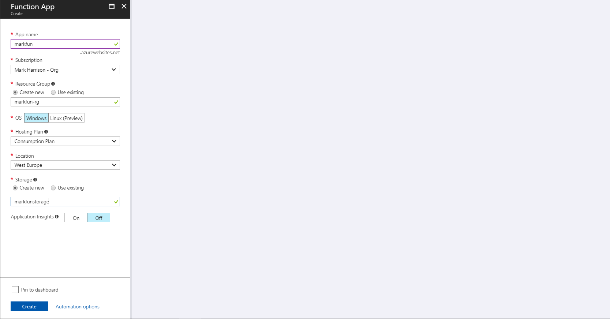

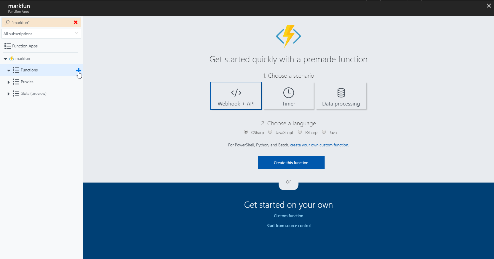

## Code HTTP Trigger

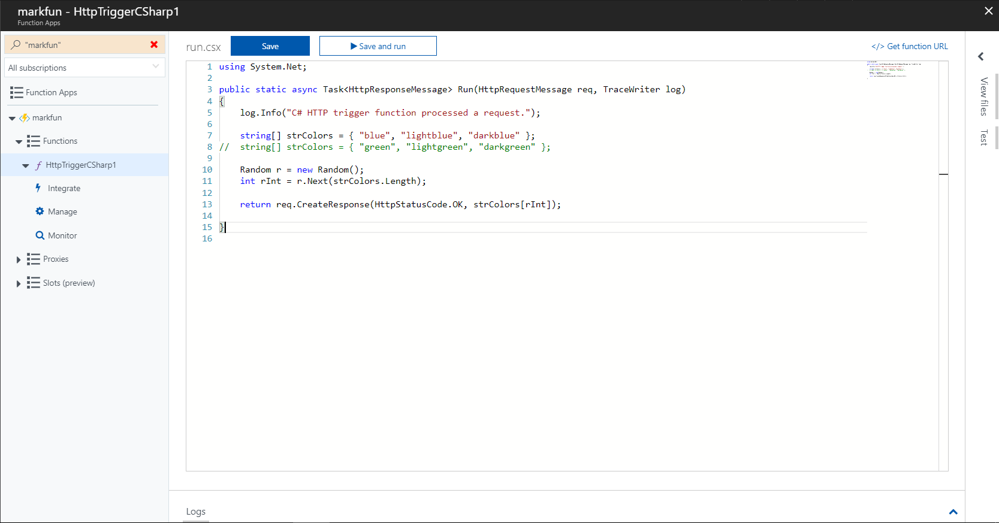

```c#
using System.Net;

public static async Task<HttpResponseMessage> Run(HttpRequestMessage req, TraceWriter log)
{
    log.Info("C# HTTP trigger function processed a request.");

    string[] strColors = { "blue", "lightblue", "darkblue" };
//  string[] strColors = { "green", "lightgreen", "darkgreen" };

    Random r = new Random();
    int rInt = r.Next(strColors.Length);

    return req.CreateResponse(HttpStatusCode.OK, strColors[rInt]);

}
```

NOTE - if using Functions V2 (.NET Core) then use 

```c#
using System.Net;
using Microsoft.AspNetCore.Mvc;

public static async Task<IActionResult> Run(HttpRequest req, ILogger log)
{
    log.LogInformation("C# HTTP trigger function processed a request.");

    string[] strColors = { "blue", "lightblue", "darkblue" };
    //string[] strColors = { "green", "lightgreen", "darkgreen" };

    Random r = new Random();
    int rInt = r.Next(strColors.Length);

    return  (ActionResult)new OkObjectResult(strColors[rInt]);
 
}
```

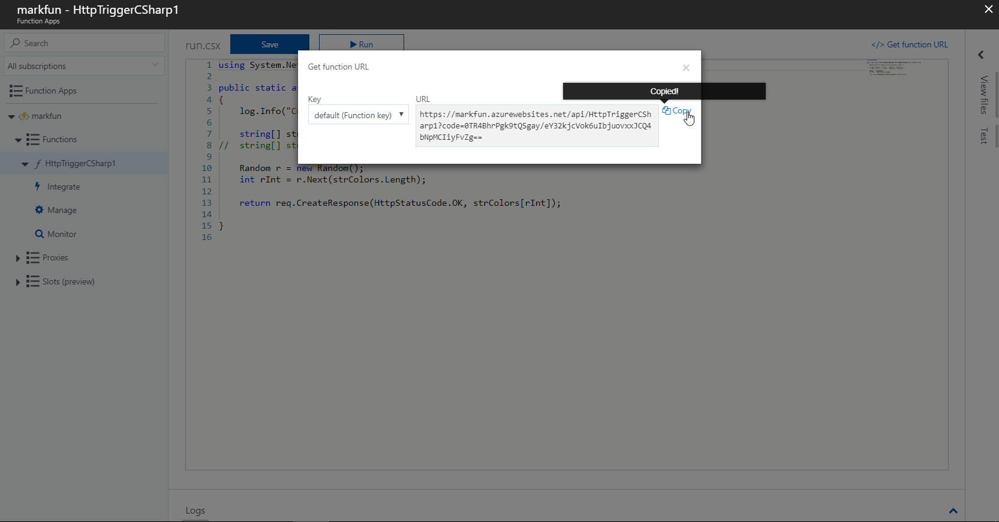

Cross-Origin Resource Sharing (CORS) allows JavaScript code running in a browser on an external host to interact with your backend.  Need to specify the origins that should be allowed.  We enable any browser to invoke the function by specifying a '*'.

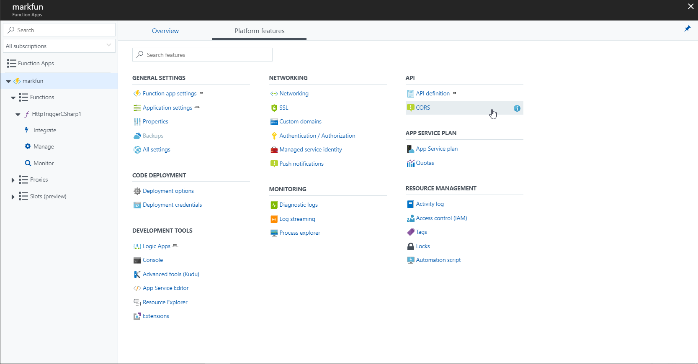

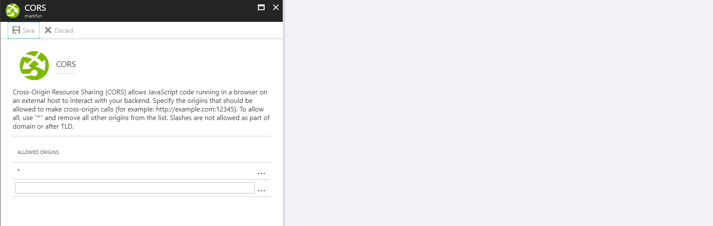

## Invoke HTTP Trigger

- Invoke the URL from a browser

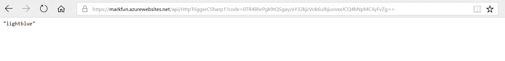

Use website <http://markcolorweb.azurewebsites.net> - this displays 500 lights.  Each light will at random intervals make a call to the RandomColor API - and then display the color returned.

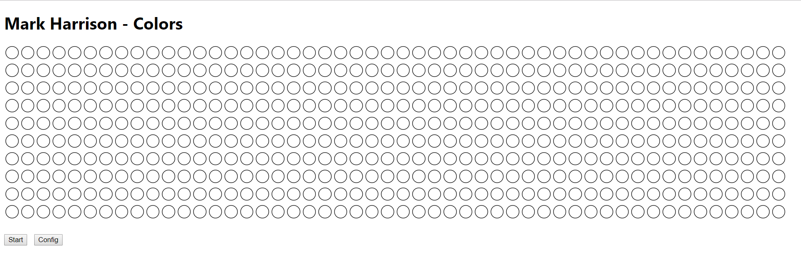

There is a configuration page to specify the API endpoint

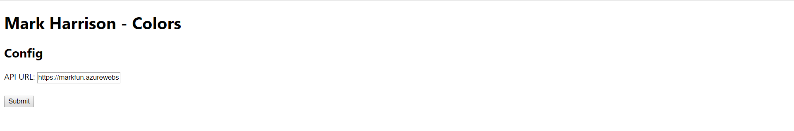

- Specify the Function URL

- Hit the start [button]

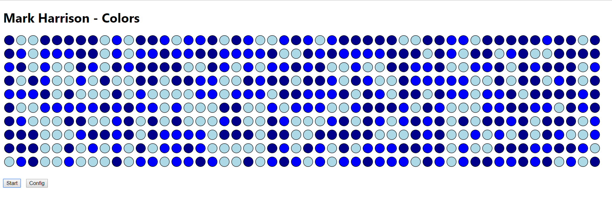

Amend the function code - to return random green colors ... Save

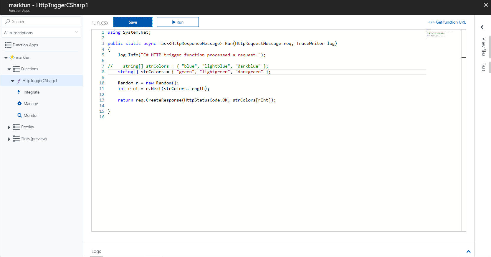

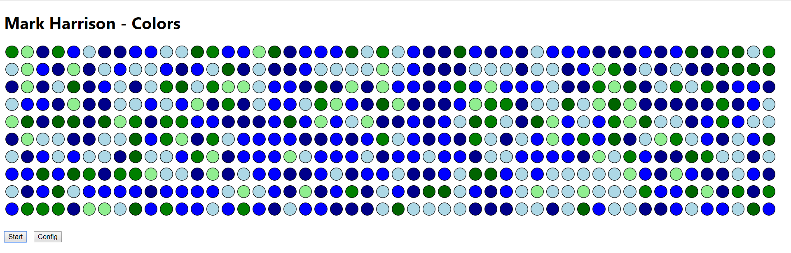

---
[Home](functions-0.md) | [Next](functions-2.md)
