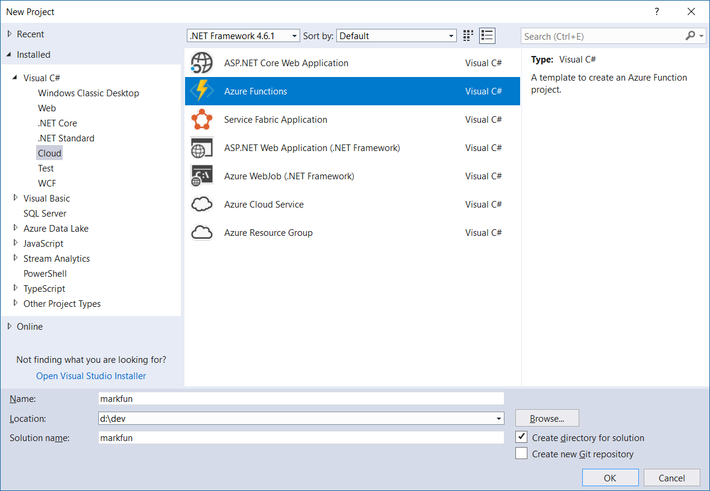
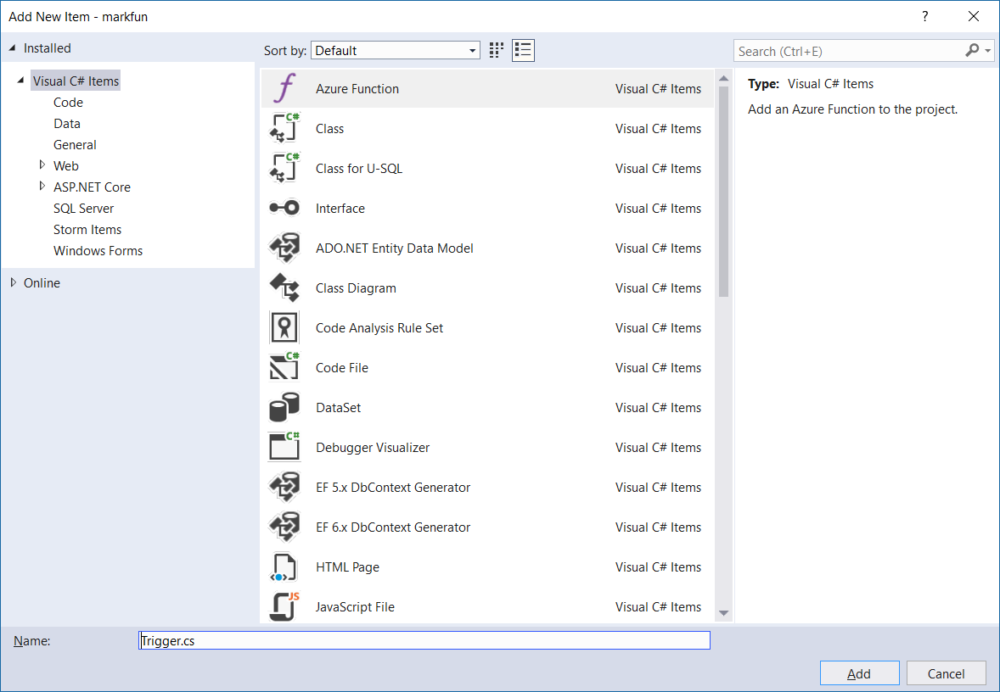
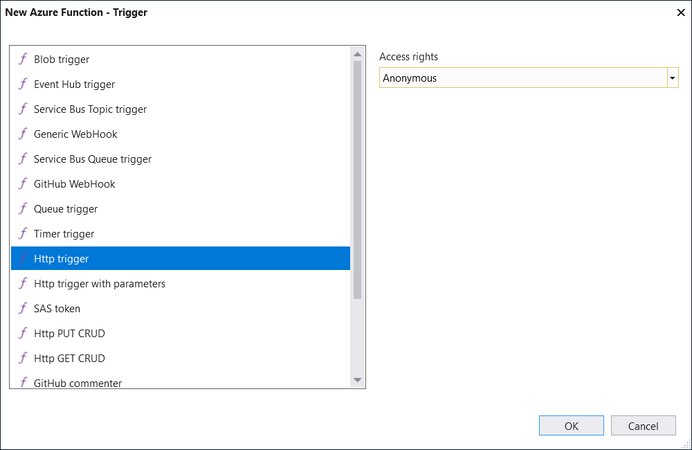
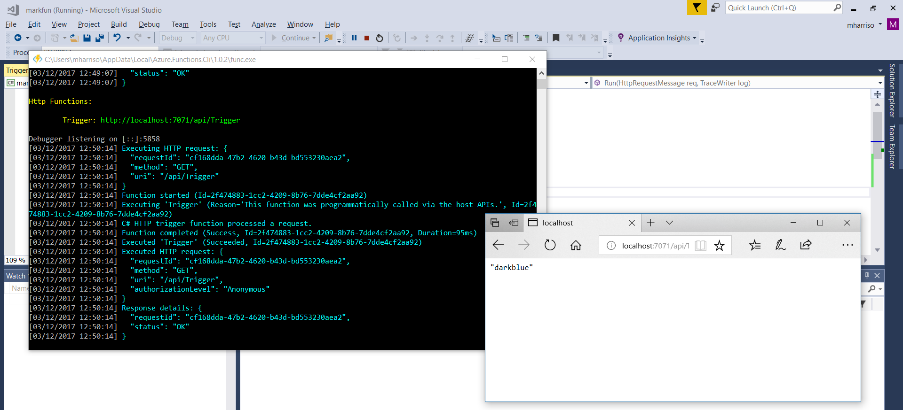
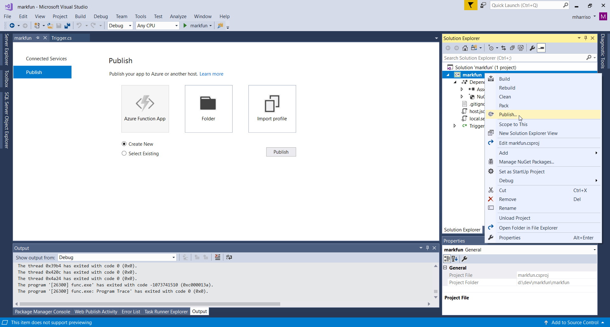
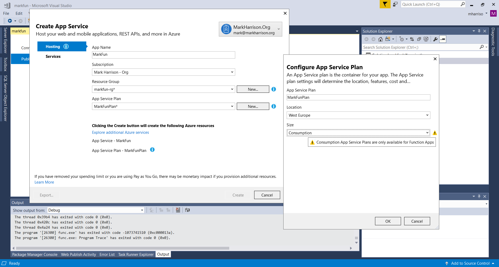
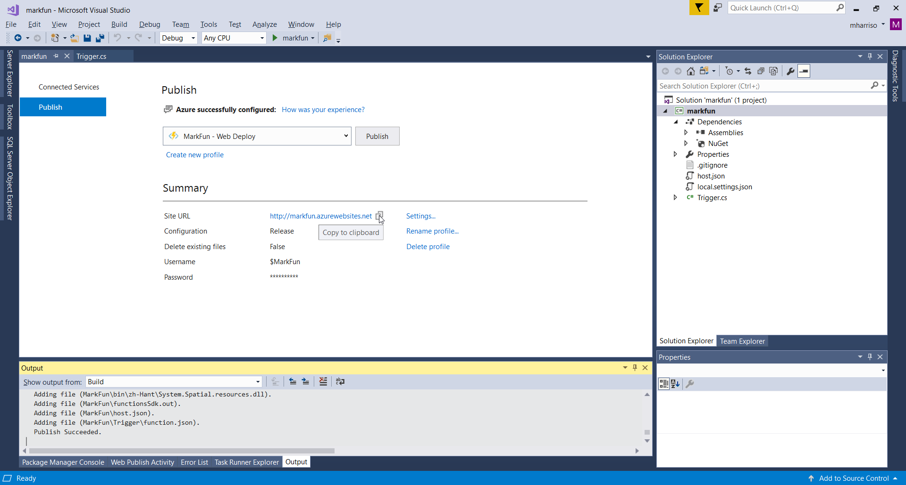
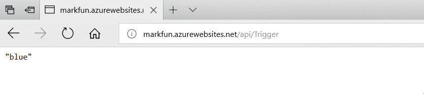

# Functions - Hands-on Lab Script - part 2

Mark Harrison : 3 Dec 2017


- [Part 1 - Functions](functions-1.md)
- [Part 2 - Functions with Visual Studio](functions-2.md)  ... this document
- [Part 3 - Functions with CLI](functions-3.md)

## Overview

Functions is a serverless compute service that enables you to run code on-demand without having to explicitly provision or manage infrastructure. Use Azure Functions to run a script or piece of code in response to a variety of events.

## Create Project

The Azure Functions project template in Visual Studio creates a project that can be published to a function app in Azure

- Using Visual Studio, create a Azure Functions project



## Add Function

- Right click on the project node, add an Azure Function

- Specify the name of the function e.g. Trigger.cs



- From the next dialog, select Http trigger
- Specify access rights to allow anonymous access



- In the Trigger code file, replace with the following code:

```C#
[FunctionName("Trigger")]
public static async Task<HttpResponseMessage> Run([HttpTrigger(AuthorizationLevel.Anonymous, "get", "post", Route = null)]HttpRequestMessage req, TraceWriter log)
{
    log.Info("C# HTTP trigger function processed a request.");

    string[] strColors = { "blue", "lightblue", "darkblue" };
    //  string[] strColors = { "green", "lightgreen", "darkgreen" };

    System.Random r = new System.Random();
    int rInt = r.Next(strColors.Length);

    return req.CreateResponse(HttpStatusCode.OK, strColors[rInt]);

}
```

## Test Function locally

We can use Visual Studio to run / debug our function locally.  We can put breakpoints in the code.

- Hit F5 to run
  - If prompted, accept the request from Visual Studio to download and install Azure Functions Core (CLI) tools



## Deploy to Azure

Once the function has been developed, it can be published to Azure.

- Right click on the prioject and select Publish



- Specify values to create the App Service





## Invoke Function

Finally we can invoke our Azure hosted function.  The URL will be:

`http://functionappname.azurewebsites.net/api/functionname>`



---
[Home](functions-0.md) | [Prev](functions-1.md) | [Next](functions-3.md)