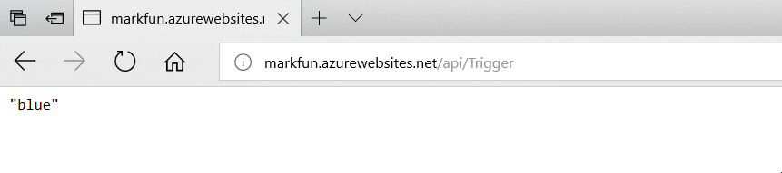

# Functions - Hands-on Lab Script - part 3

Mark Harrison : 3 Dec 2017


- [Part 1 - Functions](functions-1.md)
- [Part 2 - Functions with Visual Studio](functions-2.md)
- [Part 3 - Functions with CLI](functions-3.md)  ... this document

## Overview

Functions is a serverless compute service that enables you to run code on-demand without having to explicitly provision or manage infrastructure. Use Azure Functions to run a script or piece of code in response to a variety of events.

## Create Function App

All Azure resources must reside with an Azure resource group.

- Invoke the following:
  - Amend the resource group name to that required - and in the subsequent instructions
  - Amend the location to that require

```text
az group create --name markfun-rg --location westeurope
az configure --defaults  group=markfun-rg
```

We can create a storage account using the `az storage account create` command.

- Invoke the following:
  - Amend the storage account name to that required - and in the subsequent instructions

```text
az storage account create --name markfunstorage --sku Standard_LRS
```

We can create a function app using the `az functionapp create` command

- Invoke the following:
  - Amend the function appname to that required - and in the subsequent instructions

  - Amend the consumption plan location to that required

```text
az functionapp create --name markfun --storage-account markfunstorage  --consumption-plan-location westeurope --deployment-local-git

az functionapp list -o table
```

The output from this command will give the URL for the GIT repository used for deployment.

We can set the deployment credentials using the `az functionapp deployment` command

- Invoke the following:
  - Amend the credentials to that required

```text
az functionapp deployment user set --user-name markusername --password P@ssword1
```

## Clone repository

Clone the function to a local folder

- Invoke the following:
  - Amend the folder names to that required
  - Amend the remote git repository depending on the function app name and deployment credentials chosen
    - ://`user-name`@`function-name`.scm.azurewebsites.net/`function-name`.git

```text
cd d:\dev
git clone https://markusername@markfun.scm.azurewebsites.net/markfun.git
cd d:\dev\markfun
mkdir Trigger
```

## Add function code

- Invoke the following
  - Confirm to create the file

```text
notepad Trigger\run.csx
```

- Add the following code to run.csx

```C#
using System.Net;

public static async Task<HttpResponseMessage> Run(HttpRequestMessage req, TraceWriter log)
{
    log.Info("C# HTTP trigger function processed a request.");

    string[] strColors = { "blue", "lightblue", "darkblue" };
//  string[] strColors = { "green", "lightgreen", "darkgreen" };

    Random r = new Random();
    int rInt = r.Next(strColors.Length);

    return req.CreateResponse(HttpStatusCode.OK, strColors[rInt]);
}

```

- Invoke the following
  - Confirm to create the file

```text
notepad Trigger\function.json

```

- Add the following code to function.json

```json
{
  "disabled": false,
  "bindings": [
    {
      "authLevel": "anonymous",
      "name": "req",
      "type": "httpTrigger",
      "direction": "in"
    },
    {
      "name": "$return",
      "type": "http",
      "direction": "out"
    }
  ]
}

```

## Upload function code to Azure

- Invoke the following

```text
git add -A
git commit -m "initial"
git push

```

## Invoke Function

Finally we can invoke our Azure hosted function.  The URL will be:

`http://functionappname.azurewebsites.net/api/functionname>`



## Tidy up

Invoke the following:

```text
az group delete --name markfun-rg -y

```

---
[Home](functions-0.md) | [Prev](functions-2.md)